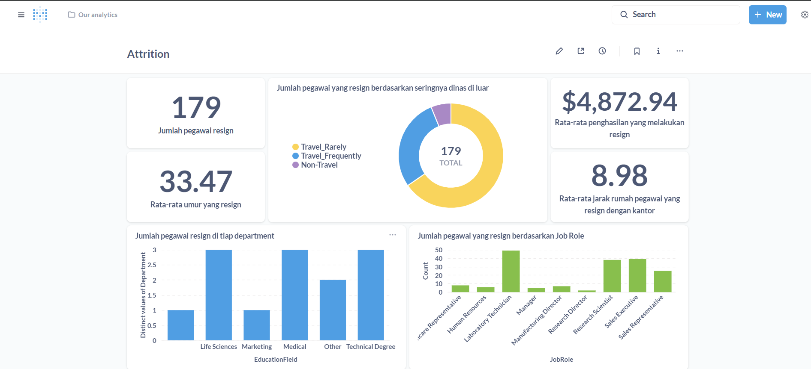

# Proyek Akhir: Menyelesaikan Permasalahan Perusahaan Edutech

## Business Understanding

Proyek ini akan mengangkat sebuah studi kasus mengenai perushaan multinasional bernama Jaya Jaya Maju. Perusahaan ini telah memiliki lebih dari 1000 karyawan yang tersebar di seluruh penjuru negeri. Walaupun telah menjadi menjadi perusahaan yang cukup besar, perusahaan ini masih cukup kesulitan dalam mengelola karyawan. Hal ini berimbas tingginya attrition rate (rasio jumlah karyawan yang keluar dengan total karyawan keseluruhan) hingga lebih dari 10%.
Untuk mencegah hal ini semakin parah, manajer departemen HR ingin meminta bantuan Anda mengidentifikasi berbagai faktor yang mempengaruhi tingginya attrition rate tersebut. Selain itu, ia juga meminta Anda untuk membuat business dashboard untuk membantunya memonitori berbagai faktor tersebut

### Permasalahan Bisnis

Perusahaan Jaya Jaya Maju mengalami masalah dalam pengelolaan sumber daya manusia yang ditandai dengan tinginya tingkat Attrition rate mencapai >10%. Kondisi ini berdampak negatif terhadap stabilitas operasional perusahaan, biaya rekrutmen, pelatihan karyawan baru dan produktivitas kerja perusahaan.

### Cakupan Proyek

Berikut beberapa cakupan proyek ini:

1. Apa saja faktor yang mempengaruhi Attrion rate pada perusahaan Jaya Jaya Maju.

### Persiapan

Pada proyek ini saya akan menentukan
Sumber data: "https://raw.githubusercontent.com/dicodingacademy/dicoding_dataset/main/employee/employee_data.csv"

## Business Dashboard

Dashboard tersebut menampilkan jumlah pegawai yang melakukan `Attrition` dan juga menampilkan beberapa faktor yang mempengaruhi tingkat `Attrition` pada perusahaan tersebut.

## Conclusion

Pada proyek ini ditemukan 412 data yang `missing value` pada kolom `Attrition`, langkah yang saya ambil selanjutnya adalah menghapus 412 data tersebut karena jumlah data yang tersisa masih cukup banyak dengan jumlah 1058 data.

Selanjutnya data saya bagi menjadi 2 berdasarkan type nya, yakni numerik dan kategorik dengan rincian 27 data numerik dan 8 data kategorik. Pada data numerik ini saya lakukan uji korelasi untuk meliihat hubungannya dengan `Attrition`.
Saat dilakukan uji korelasi ada beberapa faktor yang mempengaruhi nilai `Attrition` pada perusahaan tersebut, yaitu:

1. `Age` -0.17
2. `EnvironmentSatisfaction` -0.13
3. `JobInvolvement` -0.15
4. `JobLevel` -0.17
5. `JobSatisfaction` -0.09
6. `MonthlyIncome` -0.16
7. `StockOptionLevel` -0.16
8. `TotalWorkingYears` -0.18
9. `YearsAtCompany` -0.14
10. `YearsInCurrentRole` -0.16
11. `YearsWithCurrManager` -0.16
12. `DistanceFromHome` +0.08

Saya hapus beberapa data yang tidak ada hubungannya dengan `Attrition` dan saya lakukan modelling. dari ketiga model yang saya gunakan, logistic regression memberikan akurasi tertinggi dengan nilai 87%.

Berdasarkan

### Rekomendasi Action Items (Optional)
